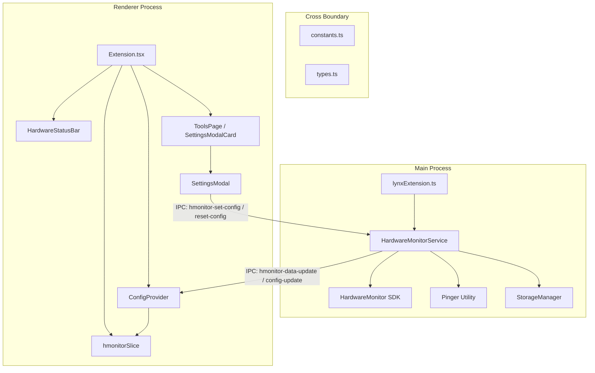

# LynxHub Hardware Monitor Extension Overview

This guide explains the architecture, components, and communication protocols of the **LynxHub Hardware Monitor Extension** (`kindaBrazy/LynxHub-hardware-Monitor`). Use this document to quickly orient yourself before making modifications.

---

## 🏗️ Architectural Design

The extension adheres to LynxHub's plugin model, dividing logic between the **Main process** (runs in Electron's Node.js environment with system access) and the **Renderer process** (runs in the Chrome frontend UI context).

---

## 📁 Key Directories & File Structure

*   **`src/cross/`**: Shared TypeScript definitions and default settings.
    *   [`constants.ts`](file:///d:/Programming/LynxHub/extension/src/cross/constants.ts): Holds the storage ID (`hmonitor_storage`), IPC channels, and the `initialSettings` object template.
    *   [`types.ts`](file:///d:/Programming/LynxHub/extension/src/cross/types.ts): All settings, status, hardware info, and ping type definitions.
*   **`src/main/`**: Node/Electron code for collecting hardware metrics.
    *   [`lynxExtension.ts`](file:///d:/Programming/LynxHub/extension/src/main/lynxExtension.ts): Main-process entrypoint registering lifecycle hook handlers (`onAppReady`, `onReadyToShow`).
    *   [`HardwareMonitorService.ts`](file:///d:/Programming/LynxHub/extension/src/main/HardwareMonitorService.ts): Singleton coordinating state, hardware discovery via `@lynxhub/hwmonitor`, ping tasks, configuration lifecycle, and IPC messaging.
    *   [`pinger.ts`](file:///d:/Programming/LynxHub/extension/src/main/pinger.ts): Utility that executes periodic ping commands to configured target hosts.
*   **`src/renderer/`**: UI components and React hook integrations.
    *   [`Extension.tsx`](file:///d:/Programming/LynxHub/extension/src/renderer/Extension.tsx): Renderer-process entrypoint. Registers Redux state slice, replaces the default host status bar, and mounts the Tools page configuration card.
    *   [`state/hmonitorSlice.ts`](file:///d:/Programming/LynxHub/extension/src/renderer/state/hmonitorSlice.ts): Redux Toolkit slice containing the frontend state tree (live telemetry data, configuration values, ping latencies).
    *   [`integrations/`](file:///d:/Programming/LynxHub/extension/src/renderer/integrations): Connection files like `ConfigProvider.tsx` (subscribes to IPC channels to update Redux settings and data) and `ToolsPage.tsx` (inserts the config trigger button).
    *   [`components/settings/`](file:///d:/Programming/LynxHub/extension/src/renderer/components/settings): Settings interface modals and controls:
        *   `SettingsModal.tsx`: Controls refresh intervals, device list visibility, section reordering, aliases.
        *   `PingSettings.tsx`: Form for ping hosts setup.
    *   [`components/status-bar/`](file:///d:/Programming/LynxHub/extension/src/renderer/components/status-bar): The UI container and section monitors:
        *   `HardwareStatusBar.tsx`: Arranges the active monitoring blocks in order.
        *   `sections/`: Separate visual templates for `CpuSection.tsx`, `GpuSection.tsx`, `MemorySection.tsx`, `NetworkSection.tsx`, `PingSection.tsx`, and `UptimeSection.tsx`.

---

## 🔄 Inter-Process Communication (IPC) & Flow

All communication between processes uses these main channels (defined in `cross/constants.ts`):

### Renderer to Main (Command Channels)
*   `HMONITOR_IPC_SET_CONFIG` (`hmonitor-set-config`): Sent when settings are altered inside `SettingsModal`. Pass a JSON-serialized `MonitoringSettings` string.
*   `HMONITOR_IPC_RESET_CONFIG` (`hmonitor-reset-config`): Triggered to reset all custom preferences, clear logs, and re-initialize hardware detection.

### Main to Renderer (Telemetry & State Channels)
*   `HMONITOR_IPC_CONFIG_UPDATE` (`hmonitor-config-update`): Sent on app load or config change. Pushes the resolved/migrated `MonitoringSettings` configuration down to the renderer.
*   `HMONITOR_IPC_DATA_UPDATE` (`hmonitor-data-update`): Transmits live telemetry sensor values captured from `@lynxhub/hwmonitor`.
*   `HMONITOR_IPC_UPDATE_PING` (`hmonitor-update-ping`): Updates the status and latency of configured ping test endpoints.
*   `HMONITOR_IPC_STOP_PING` (`hmonitor-stop-ping`): Notifies renderer that a ping target was disabled/removed.
*   `HMONITOR_IPC_MONITORING_ERROR` (`hmonitor-monitoring-error`): Pushes diagnostic/error reports from hardware SDK probing or drivers initialization.

---

## 💾 Storage & Preferences Persistence

*   **Key**: `hmonitor_storage` (represented by `HMONITOR_STORAGE_ID`).
*   **Manager**: Managed via LynxHub's core `StorageManager`.
*   **Migration Flow**: When `HardwareMonitorService` initializes, it loads the object and compares the cached version with `initialSettings.configVersion`. Outdated structures are migrated within the service's `loadConfig()` function.
*   **Fields**:
    *   `refreshInterval`: Interval in seconds between hardware checks.
    *   `enabled`: If the status bar is active.
    *   `displayStyle`: `'default' | 'compact'`.
    *   `showSectionLabel`: Toggle header labels.
    *   `enabledMetrics`: Track active hardware sections and enabled fields per device.
    *   `availableHardware`: Cached device data populated by the last hardware discovery sequence.
    *   `pingState`: Active status, hostnames list, interval, timeout configuration.
    *   `sectionOrder`: Re-orderable array of metric IDs (`['cpu', 'gpu', 'memory', 'network', 'uptime', 'ping']`).
    *   `showAlias[Cpu|Gpu|Memory|Network]`: Toggle custom names for components.

---

## 🛠️ Common Tasks & Extension Guidelines

### Adding a New Setting
1.  Add the property to the TypeScript interfaces inside `src/cross/types.ts`.
2.  Assign a default value in `initialSettings` inside `src/cross/constants.ts`.
3.  Increment the `configVersion` number in `initialSettings`.
4.  Add a migration path in `HardwareMonitorService.ts -> loadConfig()` to map existing user configurations cleanly.
5.  Implement the UI control in `src/renderer/components/settings/SettingsModal.tsx` and dispatch/save updates.

### Modifying Status Bar Layout
*   Sections are placed inside the status bar container using `sectionOrder` configured in settings.
*   To edit component styles or responsive layouts, modify `src/renderer/components/status-bar/sections/*.tsx` and their container settings inside `HardwareStatusBar.tsx`.
