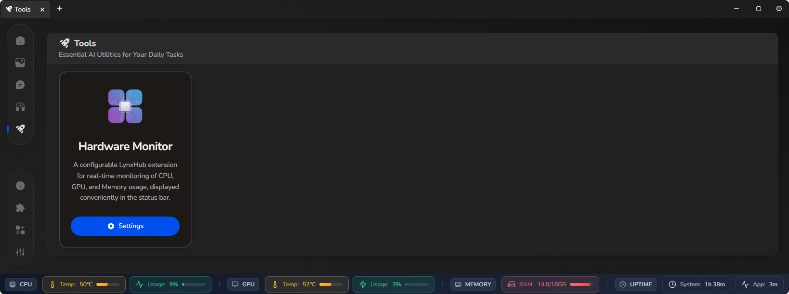
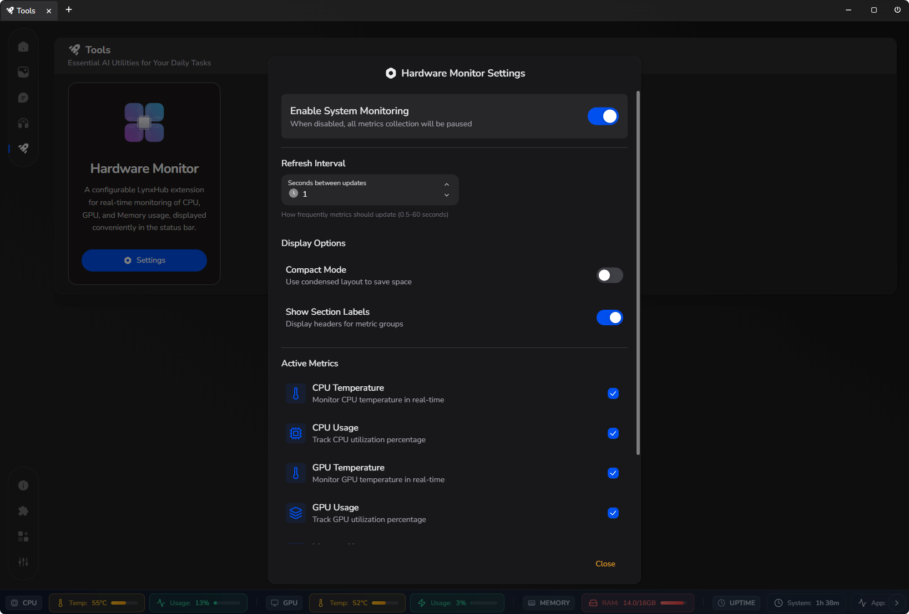

  

# LynxHub Hardware Monitor

### A configurable LynxHub extension for real-time monitoring of CPU, GPU, and Memory usage, displayed conveniently in the status bar.

  

The **LynxHub Hardware Monitor** is an extension for LynxHub that provides real-time monitoring of your system's
hardware resources directly within the application's status bar. It offers a clean, customizable, and efficient way to
keep an eye on your system's performance without leaving your workspace.

-----

## ❗ Requirements

Before using this extension:

- **.NET 9.0 Runtime**: This extension relies on the .NET 9.0 framework to gather hardware information. You can download
  it from the official Microsoft website:
    - [Download .NET 9.0 Runtime](https://dotnet.microsoft.com/en-us/download/dotnet/9.0)
- **Missing Data? Run as Administrator**: Some hardware sensors require elevated permissions to be read correctly. If
  you notice that certain metrics (like CPU temperature) are not appearing, please try running LynxHub as an
  administrator.

-----

## ✨ Features

- **Real-Time Metrics**: Track essential hardware statistics, updated at your chosen interval.
- **Comprehensive Monitoring**:
    - **CPU**: Monitor temperature and overall usage.
    - **GPU**: Keep track of GPU temperature, load, and VRAM usage.
    - **Memory**: View your current RAM usage.
    - **Uptime**: Display both total system uptime and application runtime.
- **Customizable Interface**:
    - **Compact Mode**: A sleeker, space-saving layout for the status bar.
    - **Metric Selection**: Choose exactly which metrics you want to see.
    - **Togglable Labels**: Show or hide section titles (CPU, GPU, etc.) to customize the look.
- **Visual Feedback**:
    - Dynamic progress bars for usage and temperature.
    - Color-coded indicators that change from green to red based on load, making it easy to spot high-usage components
      at a glance.

-----

## 🔧 Configuration

You can easily customize the Hardware Monitor to fit your needs.

1. Navigate to the **Tools** page in LynxHub.
2. Find the **Hardware Monitor** card and click the **Settings** button.

From the settings modal, you can:

- Enable or disable the hardware monitor entirely.
- Adjust the **refresh interval** (from 0.5 to 60 seconds).
- Toggle **Compact Mode** for a smaller footprint.
- Show or hide **section labels**.
- Select which **metrics** are displayed in the status bar.

  

-----

## 🛠️ Technology Used

- **Hardware Data**: Utilizes the [@lynxhub/hwmonitor](https://github.com/KindaBrazy/Lynx-HWMonitor) package for data
  collection.